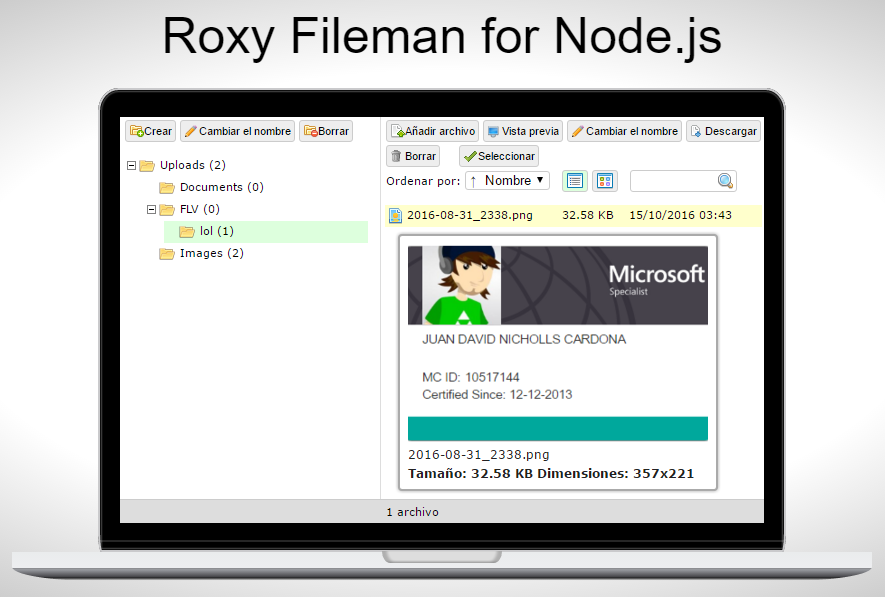

# Roxy Fileman for Node.js
Roxy Fileman for Node.js is ready for use with CKEditor and TinyMCE WYSIWYG html editors.

# Instructions
 * Install **[Node.js](https://nodejs.org)**.
 * Install **[GraphicsMagick](http://www.graphicsmagick.org/)**.
 * Download this template.
 * Execute the commands: `npm install && npm start`
 * Try in the browser http://localhost:3000
 
# Credits
 * Lyubomir Arsov - www.roxyfileman.com

# Happy coding
Made with <3

