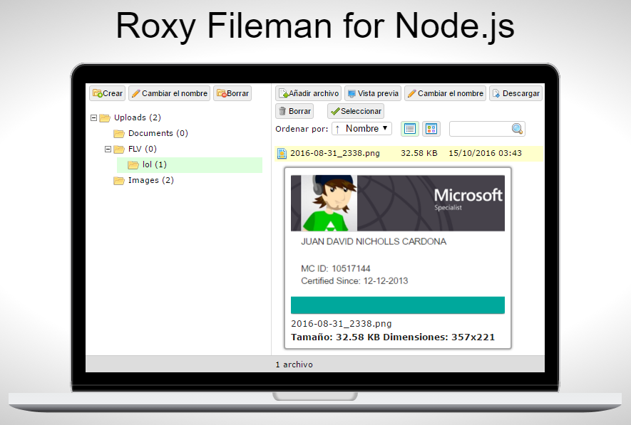

# Roxy Fileman for Node.js
Roxy Fileman is free open source file manager for .NET, PHP and Node.js, ready for use with CKEditor and TinyMCE WYSIWYG html editors. It could be easily integrated into a CMS or any other web application. Fileman is based on JQuery and JQueryUI libraries and it's compatible with all modern browsers - Internet Explorer, Firefox, Google Chrome, Safary and Opera.

## Instructions
 * Install **[Node.js](https://nodejs.org)**.
 * Install **[GraphicsMagick](http://www.graphicsmagick.org/)**.
 * Download this template.
 * Execute the commands: `npm install && npm start`
 * Try in the browser http://localhost:3000
 
## Features
 * High performance. No page reloading - all data is loaded using Ajax.
 * Multilanguage support.
 * Context menus.
 * Status bar with folder and file information.
 * Cut, copy and paste operations for files and folders.
 * Drag and drop operations for moving folders and files.
 * File and folder renaming.
 * Secure file uploads - certain file types can be forbidden in the configuration.
 * Tooltips containing file information. Dimensions and preview for the image files is available.
 * Quick file search.
 * Sorting files by name, size or modification date.
 * Toolbar with the most common tasks.
 * Simple and intuitive interface with list and thumbnail views.
 * Root folder can be set via session variable.
 * Configuration settings for image preview width and height.
 * Configuration settings for thumbnails view images width and height.
 * Configuration settings to automatically resize uploaded images to given maximum width and/or height.
 * Download folders as single zip file.
 * Upload progress bar.
 * Drag and drop file uploads.
 * Dinamyc configuration **[conf.js](https://github.com/jdnichollsc/Roxy-Fileman-for-Node.js/blob/master/routes/conf.js)**.
 
## Credits 👍
 * Lyubomir Arsov - www.roxyfileman.com
 
## Star History 🌟

## Sponsors 💜

This project is free and open source. Sponsors help keep it maintained and growing.

[**Become a Sponsor**](https://github.com/sponsors/proyecto26) | [Sponsorship Program](https://proyecto26.com/sponsors/)

## Contribution 🤝

When contributing to this repository, please first discuss the change you wish to make via issue,
email, or any other method with the owners of this repository before making a change.
 
Contributions are what make the open-source community such an amazing place to learn, inspire, and create. Any contributions you make are **greatly appreciated** ❤️.
 
You can learn more about how you can contribute to this project in the [contribution guide](https://github.com/proyecto26/.github/blob/master/CONTRIBUTING.md).

## License ⚖️
This repository is available under the [MIT License](https://github.com/proyecto26/Roxy-Fileman-for-Node.js/blob/master/LICENSE).

## Happy coding 💯
Made with ❤️ by [Proyecto 26](https://proyecto26.com) - Changing the world with small contributions.

One hand can accomplish great things, but many can take you into space and beyond! 🌌

Together we do more, together we are more ❤️ 
